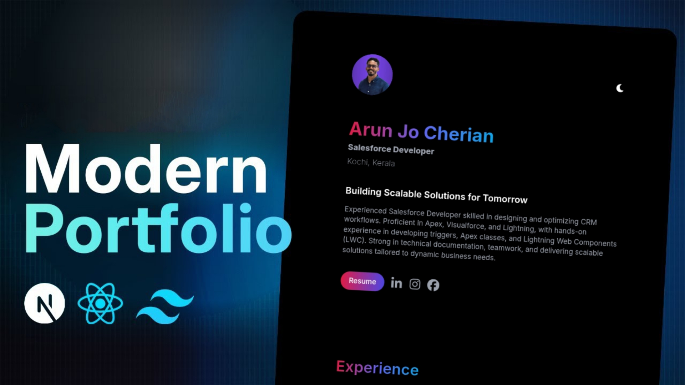

# Modern Portfolio Website

This is a **Modern Portfolio Website** built using **Next.js, Tailwind CSS, ShadCN, and Framer Motion**. The project features smooth animations, a dark mode toggle, and a professional design suitable for developers and designers looking to showcase their work.

[](https://arunjo-portfolio-web.vercel.app/)

## 🚀 Features
- **Built with Next.js** for server-side rendering and optimized performance
- **Framer Motion** for smooth animations and transitions
- **ShadCN components** (Button & Card) for UI consistency
- **Dark Mode** enabled using **Next Themes**
- **Responsive Design** with Tailwind CSS
- **Deployed on Vercel** for easy access

## 🛠️ Tech Stack
- **Next.js** - React Framework
- **Tailwind CSS** - Utility-first styling
- **Framer Motion** - Animation Library
- **ShadCN** - UI components library
- **React Icons** - Icons for UI elements

## 📂 Project Structure
```
├── app
│   ├── layout.tsx          # Root layout and theming
│   ├── page.tsx            # Main page
│   ├── components
│   │   ├── ThemeToggle.tsx # Dark mode toggle button
│   │   ├── Button.tsx      # Reusable button component
│   │   ├── Card.tsx        # Project card component
│   ├── public
│   │   ├── images          # Portfolio images
├── styles
│   ├── globals.css         # Global styles
│   ├── tailwind.config.js  # Tailwind configuration
├── README.md
```

## 🎨 UI & Animations
- **Header Section:** Includes profile image and dark mode toggle.
- **Hero Section:** Animated introduction with name and job title.
- **Experience & Education Section:** Dynamic cards for work and education history.
- **Projects Section:** Grid-based project showcase with hover effects.
- **Footer:** Copyright information.

## 🏗️ Installation & Setup
### 1️⃣ Clone the Repository
```sh
git clone https://github.com/jijojacob988/modern-portfolio.git
cd modern-portfolio
```
### 2️⃣ Install Dependencies
```sh
npm install
```
### 3️⃣ Run Development Server
```sh
npm run dev
```
Now, open **http://localhost:3000** in your browser to see the project live.

## 🌐 Deployment
The project is deployed on **Vercel**. You can visit it here:
🔗 **[Live Demo](https://arunjo-portfolio-web.vercel.app/)**

To deploy manually:
1. Push your project to a GitHub repository.
2. Go to [Vercel](https://vercel.com/) and connect your repository.
3. Click **Deploy** and your site will be live!

## 📸 Screenshots



## 🤝 Contributing
Pull requests are welcome! If you have any suggestions, feel free to open an issue or contribute to improve the project.

## 📜 License
This project is open-source and available under the **MIT License**.

---

Made with ❤️ by **Jijo Jacob**
